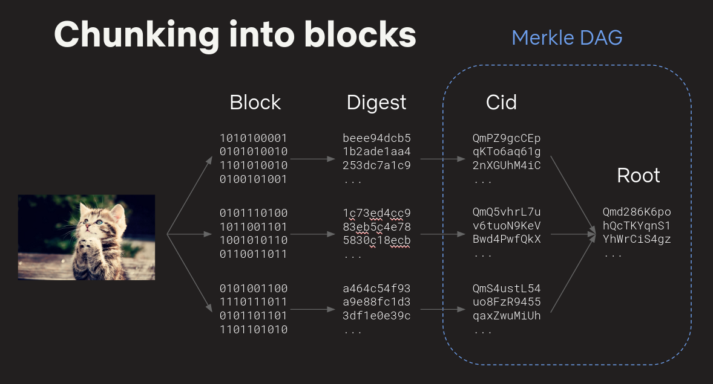
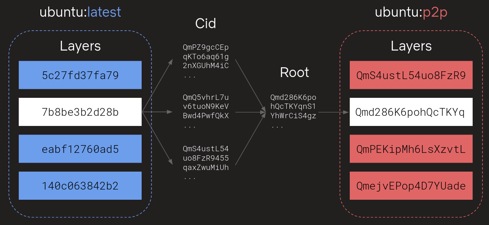

## ipcs

[](https://godoc.org/github.com/hinshun/ipcs)
[](https://travis-ci.org/hinshun/ipcs)
[](https://goreportcard.com/report/github.com/hinshun/ipcs)

Containerd meets [IPFS](github.com/ipfs/go-ipfs). Peer-to-peer distribution of content blobs.

## Getting started

Converting a manifest from DockerHub to p2p manifest:

```sh
# Term 1: Start a IPFS daemon
$ make ipfs

# Term 2: Start a rootless containerd backed by ipcs.
$ make containerd

# Term 3: Convert alpine to a p2p manifest
$ make convert
2019/06/04 13:54:40 Resolved "docker.io/library/alpine:latest" as "docker.io/library/alpine:latest@sha256:769fddc7cc2f0a1c35abb2f91432e8beecf83916c421420e6a6da9f8975464b6"
2019/06/04 13:54:40 Original Manifest [456] sha256:769fddc7cc2f0a1c35abb2f91432e8beecf83916c421420e6a6da9f8975464b6:
// ...
2019/06/04 13:54:41 Converted Manifest [456] sha256:9181f3c247af3cea545adb1b769639ddb391595cce22089824702fa22a7e8cbb:
// ...
2019/06/04 13:54:41 Successfully pulled image "localhost:5000/library/alpine:p2p"
```

Converting two manifests from DockerHub to p2p manifests, and then comparing the number of shared IPLD nodes (layers chunked into 262KiB blocks):

```sh
# Term 1: Start a IPFS daemon
$ make ipfs

# Term 2: Start a rootless containerd backed by ipcs.
$ make containerd

# Term 3: Convert ubuntu:bionic and ubuntu:xenial into p2p manifests, then bucket IPLD nodes into nodes unique to each image, and nodes inside intersect.
$ make compare
// ...
2019/06/04 13:51:33 Comparing manifest blocks for "docker.io/library/ubuntu:xenial" ("sha256:8d382cbbe5aea68d0ed47e18a81d9711ab884bcb6e54de680dc82aaa1b6577b8")
2019/06/04 13:51:34 Comparing manifest blocks for "docker.io/titusoss/ubuntu:latest" ("sha256:cfdf8c2f3d5a16dc4c4bbac4c01ee5050298db30cea31088f052798d02114958")
2019/06/04 13:51:34 Found 322 blocks
docker.io/library/ubuntu:xenial: 4503
docker.io/library/ubuntu:xenial n docker.io/titusoss/ubuntu:latest: 87550251
docker.io/titusoss/ubuntu:latest: 76117824
// 87550251 shared bytes in IPLD nodes
```

## Design

IPFS backed container image distribution is not new. Here is a non-exhaustive list of in-the-wild implementations:
- https://github.com/docker/distribution/pull/2906
- https://github.com/miguelmota/ipdr
- https://github.com/jvassev/image2ipfs/

P2P container image distribution is also implemented with different P2P networks:
- https://github.com/dragonflyoss/Dragonfly
- https://github.com/uber/kraken

The previous IPFS implementations all utilize the [Docker Registry HTTP API V2](https://docs.docker.com/registry/spec/api/) to distribute. However, the connection between containerd pulling the image and registry is not peer-to-peer, and if the registry was ran as a sidecar the content would be duplicated twice in the local system. Instead, I chose to implement it as a containerd content plugin for the following reasons:
- Containerd natively uses IPFS as a `content.Store`, no duplication.
- Allow p2p and non-p2p manifests to live together.
- Potentially do [file-granularity chunking](https://github.com/AkihiroSuda/filegrain) by introducing new layer mediatype.
- Fulfilling the `content.Store` interface will allow using `ipcs` to also back the [buildkit](https://github.com/moby/buildkit) cache.

IPFS imposes a 4 MiB limit for blocks because it may be run in a public network with adversarial peers. Since its not able to verify hashes until all the content has arrived, an attacker can send gibberish flooding connections and consuming bandwidth. Chunking data into smaller blocks also aids in deduplication:



IPCS implements containerd's `content.Store` interface and can be built as a golang plugin to override containerd's default local store. A converter implementation is also provided that converts a regular OCI image manifest to a manifest where every descriptor is replaced with the descriptor of the root DAG node added to IPFS. The root node is the merkle root of the 262KiB chunks of the layer.



Although the IPFS daemon or its network may already have the bytes for all image's P2P content, containerd has a [boltdb](https://github.com/boltdb/bolt) metadata store wrapping the underlying `content.Store`.

A image pull, starting from the client side goes through the following layers:
- `proxy.NewContentStore` (content.Store)
- content.ContentClient (gRPC client)
- content.NewService (gRPC server: plugin.GRPCPlugin "content")
- content.newContentStore (content.Store: plugin.ServicePlugin, services.ContentService)
- metadata.NewDB (bolt *metadata.DB: plugin.MetadataPlugin "bolt")
- ipcs.NewContentStore (content.Store: plugin.ContentPlugin, "ipcs")

So in the case of this project `ipcs`, a pull is simply flushing through its `content.Store` layers to register the image in containerd's metadata stores. Note that the majority of the blocks don't need to be downloaded into IPFS's local storage in order to complete a pull, and can be delayed until unpacking the layers into snapshots.

## Results

Collected data on: `7/06/2019`

Systems:
- m5.large x 3
- 8.0 GiB Memory
- 2 vCPUs
- Up to 10 Gigabit (Throttled by [AWS network credits](https://docs.aws.amazon.com/AWSEC2/latest/UserGuide/burstable-performance-instances.html))
- Linux kernel 4.4.0
- Ubuntu 16.04.6 LTS
- Containerd v1.2.6
- IPFS v0.4.21

Configuration:
- Switch libp2p mux from `yamux` to `mplex`: `export LIBP2P_MUX_PREFS="/mplex/6.7.0"`
- Set flatfs `sync` to `false`
- Enable experimental `StrategicProviding`

Comparison:
- Pull from DockerHub / Private docker registries
- Shard content chunks evenly to 3 nodes such that each node has roughly 33% of IPFS blocks.

Image | Total size (bytes) | IPFS blocks | DockerHub pull (secs) | IPFS pull (secs) | Diff (Hub/IPFS)
----- | ------------------ | ----------- | --------------------- | ---------------- | ---------------
docker.io/library/alpine:latest | 2759178 | 14 | 1.430587576 | 0.700885049 | 204.11%
docker.io/library/ubuntu:latest | 28861894 | 38 | 2.079848393 | 1.135062637 | 183.24%
docker.io/library/golang:latest | 296160075 | 380 | 4.817960124 | 6.401633512 | 75.26%
docker.io/ipfs/go-ipfs:latest | 23545678 | 103 | 1.182348947 | 2.041237958 | 57.92%

IPFS's performance seems to slow down as the number of nodes (size of total image) goes up. There was a recent regression in `go-ipfs` v0.4.21 that was fixed in this commit on `master`:
- https://github.com/ipfs/go-ipfs/commit/aee8041f03285811455bc392ca04a2ba0ecb28f0
- https://github.com/ipfs/go-peertaskqueue/pull/7

As seen from `make compare`, there also doesn't seem to be any improvements in deduplication between IPFS chunks as opposed to OCI layers:

```sh
$ GO111MODULE=on IPFS_PATH=./tmp/ipfs go run ./cmd/compare docker.io/library/alpine:latest docker.io/library/ubuntu:latest docker.io/library/golang:latest docker.io/ipfs/go-ipfs:latest
// ...
2019/06/04 13:39:55 Found 1381 blocks
docker.io/ipfs/go-ipfs:latest: 46891351
docker.io/library/alpine:latest: 5516903
docker.io/library/golang:latest: 828096081
docker.io/library/ubuntu:latest: 57723854
// Zero block intersection, they are very different images though.
```

Serious usage of p2p container image distribution should consider Dragonfly and Kraken, because IPFS suffers from performance issues:
- [ ] Bitswap transfer is slow [ipfs/go-ipfs#5723](https://github.com/ipfs/go-ipfs/issues/5723)
- [ ] IPFS uses excessive bandwidth [ipfs/go-ipfs#3429](https://github.com/ipfs/go-ipfs/issues/3429)
- [ ] Slow pins when there are many pins [ipfs/go-ipfs#5221](https://github.com/ipfs/go-ipfs/issues/5221) 

Related benchmarking:
- https://github.com/ipfs/go-ipfs/issues/5226
- https://github.com/ipfs/go-ipfs/issues/6382
- https://github.com/ipfs/go-ipfs/issues/3131
- https://github.com/ipfs/go-ipfs/issues/3316
- https://github.com/ipfs/go-ipfs/issues/3317
- https://github.com/ipfs/go-ipfs/issues/3860
- https://github.com/ipfs/go-ipfs/issues/5037
- https://github.com/ipfs/go-ipfs/issues/5420

## Next steps

Explore deduplication by adding each layer's uncompressed, untared files into IPFS to get chunked-file-granular deduplication. IPFS's Unixfs (UNIX/POSIX fs features implemented via IPFS) needs the following:
- Support for tar file metadata (uid, gid, modtime, xattrs, executable bit, etc):
  - [ ] https://github.com/ipfs/unixfs-v2/issues/1
- Support for hard links, character/block devices, fifo:
  - [ ] https://github.com/ipfs/go-ipfs/issues/1642
- Implementation of `diff.Comparer` and `diff.Applier` to apply custom IPFS layer mediatype to containerd's tmpmount. 

Explore IPFS-FUSE mounted layers for lazy container rootfs:
- Same requirements as above.
- Possible snapshotter interface changes:
  - [ ] https://github.com/containerd/containerd/issues/2968
  - [ ] https://github.com/containerd/containerd/issues/2943
  - https://docs.google.com/document/d/1TmNWnmbx-fd2wUhujuUtAeSUuulWZyhggAKCSc1F3AE/edit

Explore IPFS tuning to improve performance
- Tune goroutine/parallelism in various IPFS components.
- Tune datastore (use experimental [go-ds-badger](https://github.com/ipfs/go-ds-badger)?)
  - `badgerds` is hard to shard for benchmarking purposes, because GC doesn't remove data on disk: https://github.com/ipfs/go-ds-badger/issues/54
- Profile / trace performance issues and identify hotspots.
